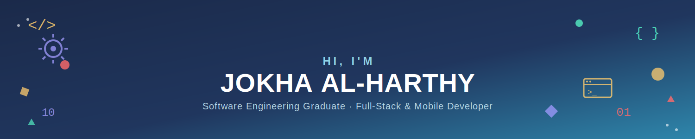

<div align="center">



<br/>


<br/><br/>

<a href="https://www.linkedin.com/in/jokha-al-harthy-471788333">
  
</a>
<a href="mailto:jokha.hamed.offical@gmail.com">
  
</a>
<a href="https://github.com/urfavjj">
  
</a>


</div>

<br/>

## 👋 About Me

I'm a Software Engineering graduate who likes owning a problem end-to-end UI, backend logic, and the database underneath. I learn fast, ship real things (not just class assignments).

```java
public class JokhaAlHarthy implements SoftwareEngineer {
    String base = "Muscat, Oman";
    String[] strengths = {"Full-Stack Dev", "Mobile Apps", "AI-powered Tools"};

    public boolean openToWork() {
        return true;
    }
}
```

- 🎓 BSc Software Engineering, University of Technology and Applied Sciences (2021 – 2026)
- 🚀 Shipped 6+ real projects: mobile apps, AI-powered planners, and full-stack web platforms
- 🌱 Currently deepening: Software Architecture · AI & Data Science
- 💬 Ask me about full-stack development, mobile apps, or turning a class project into something people actually use

<br/>

## 🛠️ Tech Stack

<div align="center">


</div>

<table align="center">
<tr>
<td valign="top" width="33%">

**Languages**
- Python · Java
- JavaScript · TypeScript
- PHP · SQL

</td>
<td valign="top" width="33%">

**Frontend & Design**
- HTML5 · CSS3 · React
- Figma · UX/UI

</td>
<td valign="top" width="33%">

**Tools & Practice**
- Git & GitHub
- Agile & Scrum
- OOP · Data Structures & Algorithms

</td>
</tr>
</table>

<br/>

## 🚀 Featured Projects

<table>
<tr>
<td width="50%" valign="top">

### 🤖 Wajeeh
Graduation project. An AI-powered travel itinerary planner that turns a user's preferences into a day-by-day plan — built end-to-end as a mobile app.

`Java` `AI` `Mobile`

🔗 [View Repository](https://github.com/Jokha-AlHarthy/Wajeeh-Mobile-Application-Travel-Itinerary)

</td>
<td width="50%" valign="top">

### ✈️ RoamAura
Full-stack web app that generates personalized travel itineraries based on budget, travel style, and preferences — built during Rihal's training program.

`Full-Stack` `AI`

🔗 [View Repository](https://github.com/moodyminji/Automated-Travel-Itinerary-Generator-SparkToCode-Project)

</td>
</tr>
<tr>
<td width="50%" valign="top">

### 🗺️ Tajawal
A website for planning travel itineraries.

`Web`

🔗 [View Repository](https://github.com/Jokha-AlHarthy/Tajawal)

</td>
<td width="50%" valign="top">

### 📋 Mulaskhasy
A students' reservation summaries system.

`Mobile`

🔗 [View Repository](https://github.com/Jokha-AlHarthy/Mobile-Application-Assignment)

</td>
</tr>
</table>

<br/>

## 📊 GitHub Analytics

<div align="center">


<br/>


</div>

<br/>

<div align="center">

### 📫 I'm open to Software Engineering roles — let's talk

<a href="https://www.linkedin.com/in/jokha-al-harthy-471788333">
  
</a>
<a href="mailto:jokha.hamed.offical@gmail.com">
  
</a>

<br/><br/>
